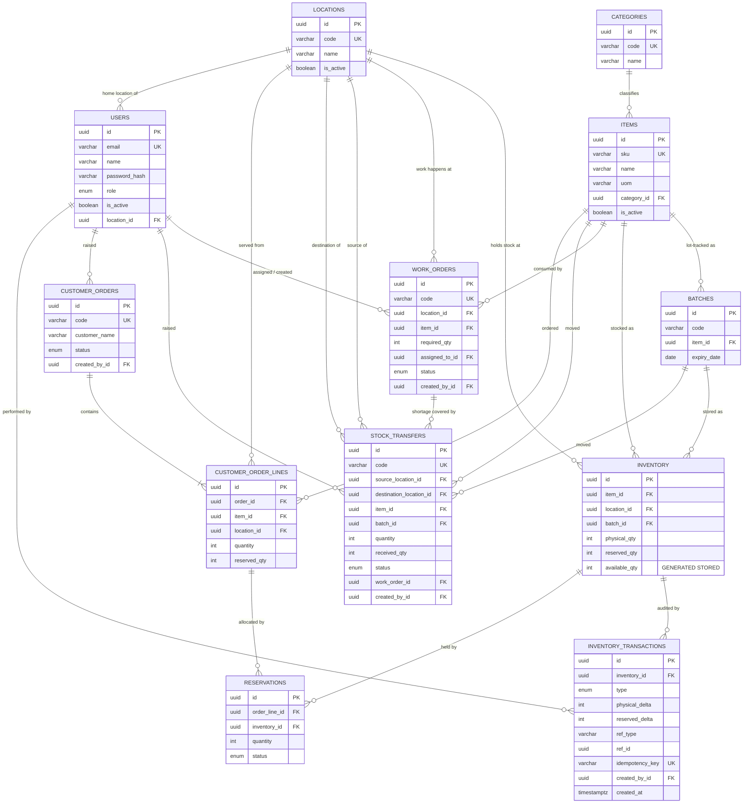

# Database Schema

PostgreSQL 14+. The schema is created entirely by the checked-in migrations in
`backend/src/database/migrations/` — `synchronize` is `false` in every environment, so
development, CI and production converge on identical DDL, including the CHECK constraints
the business rules depend on.

---

## Entity relationship diagram



---

## The stock model in one paragraph

`inventory` holds one row — a *bucket* — per `(item, location, batch)`. That is the finest
grain the business needs and the coarsest that still makes locking cheap: reserving stock
locks exactly one narrow row rather than an entire item or location. `physical_qty` and
`reserved_qty` are stored; `available_qty` is a PostgreSQL **STORED generated column** so
the database recalculates it on every write and it can be filtered and indexed in SQL.
Every change to either quantity also appends one immutable row to
`inventory_transactions`, so the balance is always reproducible from the ledger.

---

## Constraints that enforce the business rules

These live in the migration, not in application code, so they hold even against a stray
`psql` session or a future code path that forgets to take a lock.

| Table | Constraint | Enforces |
| --- | --- | --- |
| `inventory` | `CHECK (physical_qty >= 0)` | Stock can never go negative |
| `inventory` | `CHECK (reserved_qty >= 0)` | A negative hold is meaningless |
| `inventory` | `CHECK (reserved_qty <= physical_qty)` | **Overselling is unstorable** |
| `inventory` | `UNIQUE (item_id, location_id, batch_id)` | One bucket per combination — no split balances |
| `inventory_transactions` | `UNIQUE (idempotency_key)` | The same movement cannot be applied twice |
| `stock_transfers` | `CHECK (quantity > 0)` | No zero or negative transfers |
| `stock_transfers` | `CHECK (received_qty >= 0 AND received_qty <= quantity)` | Cannot receive more than was dispatched |
| `stock_transfers` | `CHECK (source_location_id <> destination_location_id)` | A transfer to itself would corrupt the ledger |
| `work_orders` | `CHECK (required_qty > 0)` | No empty work orders |
| `customer_order_lines` | `CHECK (quantity > 0)` | No empty order lines |
| `customer_order_lines` | `CHECK (reserved_qty >= 0 AND reserved_qty <= quantity)` | Cannot hold more than was ordered |
| `reservations` | `CHECK (quantity > 0)` | No empty reservations |

Foreign keys use `RESTRICT` for anything that stock depends on (you cannot delete a
location that still holds inventory), `CASCADE` where the child has no independent
existence (order lines belong to their order), and `SET NULL` for soft references (a
deleted user leaves their ledger entries intact but unattributed).

---

## Indexes

| Table | Index | Supports |
| --- | --- | --- |
| `inventory` | `(location_id, item_id)` | The Inventory screen's main filter |
| `inventory_transactions` | `(inventory_id, created_at)` | Movement history for one bucket |
| `inventory_transactions` | `(ref_type, ref_id)` | "What did work order X reserve?" |
| `batches` | `(expiry_date)` | FEFO allocation ordering |
| `work_orders` | `(status)`, `(location_id, item_id)` | List filters and availability joins |
| `stock_transfers` | `(status)`, `(source_location_id)`, `(destination_location_id)` | List filters |
| `customer_orders` | `(status)` | List filter |
| `reservations` | `(order_line_id)`, `(inventory_id, status)` | Release and reconciliation queries |
| `users` | `(role)` | Assignment dropdowns |

---

## Enum types

Stored as native PostgreSQL enums, so the database rejects an invalid status:

| Type | Values |
| --- | --- |
| `user_role` | `ADMIN`, `OPERATIONS`, `SALES` |
| `work_order_status` | `ASSIGNED`, `IN_PROGRESS`, `COMPLETED` |
| `transfer_status` | `REQUESTED`, `DISPATCHED`, `RECEIVED` |
| `order_status` | `DRAFT`, `RESERVED`, `FULFILLED`, `CANCELLED` |
| `reservation_status` | `ACTIVE`, `RELEASED`, `CONSUMED` |
| `inventory_txn_type` | `RECEIPT`, `ISSUE`, `ADJUSTMENT`, `RESERVE`, `RELEASE`, `CONSUME`, `TRANSFER_OUT`, `TRANSFER_IN` |

---

## Ledger semantics

Each movement type changes the two quantities differently. This table *is* the inventory
model:

| Type | `physical_delta` | `reserved_delta` | Effect on available | Raised by |
| --- | --- | --- | --- | --- |
| `RECEIPT` | `+q` | `0` | `+q` | Goods received into a location |
| `ADJUSTMENT` | `±q` | `0` | `±q` | Cycle count, write-off |
| `RESERVE` | `0` | `+q` | `−q` | Order reservation, work order start |
| `RELEASE` | `0` | `−q` | `+q` | Order cancellation |
| `CONSUME` | `−q` | `−q` | `0` | Order fulfilment, work order completion |
| `TRANSFER_OUT` | `−q` | `0` | `−q` | Transfer dispatch |
| `TRANSFER_IN` | `+q` | `0` | `+q` | Transfer receipt |

Note that `CONSUME` leaves availability unchanged — those units were already spoken for
and were never available. And that `TRANSFER_OUT` has no matching `TRANSFER_IN` until the
goods actually arrive: that gap is the in-transit quantity, deliberately visible at
neither end.

---

## Reporting view

`v_inventory_available` flattens the four-way join so operational queries and ad-hoc SQL
do not have to repeat it:

```sql
SELECT location_code, sku, item_name, batch_code,
       physical_qty, reserved_qty, available_qty
  FROM v_inventory_available
 WHERE available_qty > 0
 ORDER BY location_code, sku;
```

---

## Document numbering

`WO-000001`, `TR-000001`, `SO-000001` come from PostgreSQL sequences
(`work_order_seq`, `stock_transfer_seq`, `customer_order_seq`), not from `MAX(code) + 1` in
JavaScript. `nextval()` is atomic and never hands the same value to two sessions, so two
users creating a work order in the same millisecond cannot collide.
